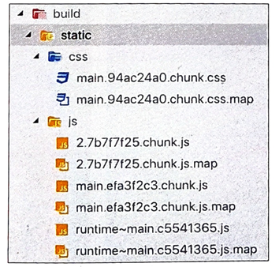
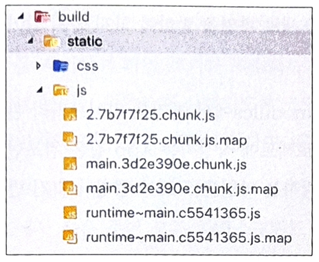
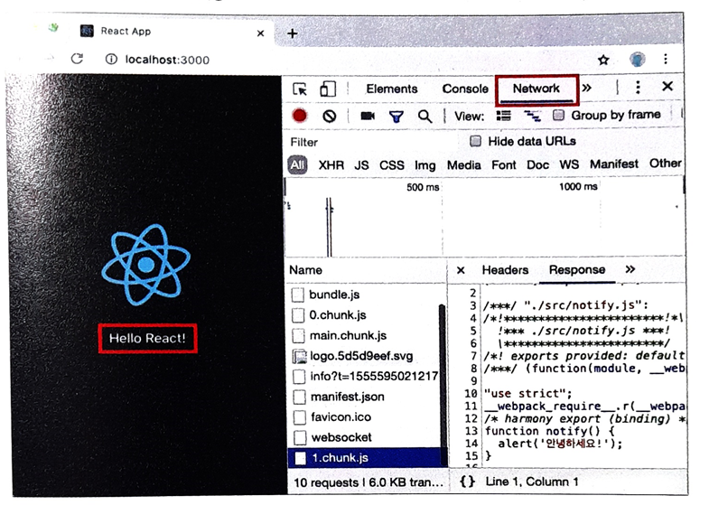

# 코드 스플리팅

> 리액트 프로젝트를 완성하여 사용자에게 제공할 때는 빌드 작업을 거쳐서 배포해야 합니다. 빌드 작업을 통해 프로젝트에서 사용되는 자바스크립트르 파일 안에서 불필요한 주석, 경고메세지, 공백 등을 제거하여 파일 크기를 최소화하기도 하고, 브라우저에게 JSX 문법이나 다른 최신 자바스크립트 문법이 원활하게 실행되도록 코드의 트랜스파일 작업도 할 수 있습니다. 만약 프로젝트 내에 이미지와 같은 정적 파일이 있다면 해당 파일을 위한 경로도 설정되지요.
> 
> 이 작업은 웹팩(webpack)이라는 도구가 담당합니다. 웹팩에서 별도의 설정을 하지 않으면 프로젝트에서 사용 중인 모든 자바스크립트 파일이 하나의 파일로 합쳐지고, 모든 CSS 파일도 하나의 파일로 합쳐집니다.
> 
> CRA로 프로젝트를 빌드할 경우 최소 두 개 이상의 자바스크립트 파일이 생성되는데, CRA의 기본 웹팩 설정에는 SplitChunks라는 기능이 적용되어 node_modules에서 불러온 파일, 일정 크기 이상의 파일, 여러 파일 간에 공유된 파일을 자동으로 따로 분리시켜서 캐싱의 효과를 제대로 누릴 수 있게 해 줍니다.


리액트 프로젝트를 생성해서 빌드해봅시다.

```
yarn create react-app splitting-sample
cd splitting-sample
yarn build
```

프로젝트 디렉터리 안에 있는 <code>build/static</code> 디렉토리를 열어 보세요. 자바스크립트 파일 여러 개가 만들어져 있습니다.



> 파일 이름을 보면 '7b7b7b'와 같은 해시(hash) 값이 포함되어 있습니다. 이 값은 빌드하는 과정에서 해당 파일의 내용에 따라 생성되며, 이를 통해 브라우저가 새로 파일을 받아야 할지 받지 말아야 할지를 알 수 있습니다.
> 
> 현재 2로 시작하는 파일에는 React, ReactDOM 등 node_modules에서 불러온 라이브러리 관련 코드가 들어 있고, main으로 시작하는 파일에는 직접 프로젝트에 작성하는 App 같은 컴포넌트에 대한 코드가 들어가 있습니다. 열어보면 2로 시작하는 파일은 코드가 매우 긴 반면, main으로 시작하는 파일은 코드가 매우 짧을 것입니다.
> 
> <code>SplitChunks</code>라는 웹팩 기능을 통해 자주 바뀌지 않는 코드들이 2로 시작하는 파일에 들어 있기 때문에 캐싱의 이점을 더 오래 누릴 수 있습니다.


2로 시작하는 파일 이름을 확인하세요(예시와 해시값은 다를 수 있습니다.). 그 다음에 App.js의 코드를 변경해 봅시다.

#### App.js

```jsx
import logo from './logo.svg'
import './App.css';

function App() {
    return (
        <div className="App">
            <header className="App-header">
                
                <p>Hello React!</p>
            </header>
        </div>
    );
}

export default App;
``` 

<code>yarn build</code> 명령어로 프로젝트를 다시 빌드 합니다.<br>
빌드 후 <code>build/static</code> 디렉터리를 다시 열어 보면 기존에 node_modules에서 불러온 라이브러리가 들어 있던 2로 시작하는 파일의 이름은 바뀌지 않았고, 작성하는 컴포넌트 관련 코드가 들어 있던 main으로 시작하는 파일의 이름은 바뀐 것을 확인할 수 있습니다.



이렇게 파일을 분리하는 작업을 <code>코드 스플리팅</code>이라고 합니다. 프로젝트에 기본 탑재된 <code>SplitChunks</code>기능을 통한 코드 스플리팅은 단순히 효율적인 캐싱 효과만 있을 뿐입니다. 예를 들어 페이지 A, B, C로 구성된 싱글 페이지 애플리케이션(SPA)을 개발한다고 가정해 봅시다. 사용자가 A 페이지에 방문했다면 B 페이지와 C 페이지에서 사용하는 컴포넌트 정보는 필요하지 않습니다. 사용자가 실제로 B 혹은 C 페이지로 이동하려고 할 때만 필요합니다.<br><br>

하지만 리액트 프로젝트에 별도로 설정하지 않으면 A,B,C 컴포넌트에 대한 코드가 모두 한 파일(main)에 저장되어 버립니다. 만약 애플리케이션의 규모가 커지면 지금 당장 필요하지 않은 컴포넌트 정보도 모두 불러오면서 파링 크기가 매우 커집니다. 그러면 로딩이 오래 걸리기 때문에 사용자 경험도 안 좋아지고 트래픽도 많이 나오게됩니다. <br><br>

이러한 문제점을 해결해 줄 수 있는 방법이 바로 <code>코드 비동기 로딩</code>입니다. 이 또한 코드 스플리팅 방법 중 하나입니다. 코드 비동기 로딩을 통해 자바스크립트 함수, 객체, 혹은 컴포넌트를 처음에는 불러오지 않고 필요한 시점에 불러와서 사용할 수 있습니다.

# 자바스크립트 함수 비동기 로딩 

컴포넌트 코드를 스플리팅하기 앞서 일반 자바스크립트 함수를 스플리팅해 보겠습니다. src 디렉터리에 notify.js 파일을 생성하여 다음 함수를 작성해보세요.


> notify.js

```jsx
export default function notify() {
    alert('안녕하세요!');
}
```

**Hello React!** 문구를 누르면 notify 함수가 실행되도록 App 컴포넌트를 수정합니다.

> src/App.js

```jsx
import logo from './logo.svg';
import './App.css';
import notify from './notify';

function App() {
    const onClick = () => {
        notify();
    };
    
    return (
        <div className="App">
            <header className="App-header">
                
                <p onClick={onClick}>Hello React</p>
            </header>
        </div>
    );
}

export default App;
```

이렇게 코드를 작성하고 빌드하면 notify 코드가 main 파일 안에 들어가게 됩니다. 하지만 다음과 같이 import를 상단에서 하지 않고 <code>import()</code> 함수 형태로 메서드 안에서 사용하면, 파일을 따로 분리시켜서 저장합니다. 그리고 실제 함수가 필요한 지점에 파일을 불러와서 함수를 사용할 수 있습니다. <br><br>

코드를 다름과 같이 수정합니다.

> src/App.js

```jsx
import logo from './logo.svg';
import './App.css';

function App() {
    const onClick = () => {
        import('./notify').then(result => result.default());
    };
    
    return (
        <div className="App">
            <header className="App-header">
                
                <p onClick={onClick}>Hello React</p>
            </header>
        </div>
    );
}

export default App;
```

import를 함수로 사용하면 Promise를 반환합니다. 이렇게 import를 함수로 사용하는 문법은 비록 아직 표준 자바스크립트가 아니지만, stage-3 단계에 있는 dynamic import라는 문법입니다. 현재는 웹팩에서 지원하고 있으므로 별도의 설정 없이 프로젝트에 바로 사용할 수 있습니다. 이 함수를 통해 모듈을 불러올 때 모듈에서 <code>default</code>로 내보낸 것은 <code>result.default</code>를 참조해야 사용할 수 있습니니다.<br><br>

브라우저를 열고 개발자 도구의 Network 탭을 연 다음, Hello React!를 클릭해 보세요.



<b>Hello React!</b>를 클릭하는 시점에 새로운 자바스크립트 파일을 불러올 것입니다. 불러온 파일의 내용을 확인해 보면 notify에 관련된 코드만 들어 있습니다. 

# React.lazy와 Suspense를 통한 컴포넌트 코드 스플리팅


> 코드 스플리팅을 위해 리액트에 내장된 기능으로 유틸 함수인 <code>React.lazy</code>와 컴포넌트인 <code>Suspense</code>가 있습니다. 이 기능은 리액트 16.6 버전부터 도입되었습니다. 이전 버전에서는 <code>import</code> 함수를 통해 불러온 다음, 컴포넌트 자체를 state에 넣는 방식으로 구현해야 합니다.

## state를 사용한 코드 스플리팅

<code>React.lazy</code>를 사용하기 앞서, <code>React.lazy</code> 없이 컴포넌트의 코드를 스플리팅하는 방법을 알아봅시다. 

> SplitMe.js

```jsx
const SplitMe = () => {
    return <div>SplitMe</div>;
};

export default SplitMe;
```

App 컴포넌트 클래스형 컴포넌트로 전환해 주세요. 그리고 handleClick 메서드를 만들고, 그 내부에 SplitMe 컴포넌트를 불러와 state에 넣겠습니다. 또한 render 함수에서는 state안에 있는 SplitMe가 유효하다면 SplitMe를 렌더링해 주어야 합니다.

> src/App.js

```jsx
import { Component } from 'react';
import logo from './logo.svg';
import './App.css';

class App extends Component {
    state = {
        SplitMe: null  
    };
    handleClick = async () => {
        const loadedModule = await import('./SplitMe');
        this.setState({
            SplitMe: loadedModule.default
        });
    };
    render() {
        const { SplitMe } = this.state;
        return (
            <div className="App">
                <header className="App-header">
                    
                    <p onClick={this.handleClick}>Hello React!</p>
                    {SplitMe && <SplitMe />}
                </header>
            </div>
        );
    }
}

export default App;
```

브라우저의 개발자 도구에서 **Network** 탭을 열고 **Hello React!**를 눌러 보면 SplitMe 컴포넌트의 코드 스플리팅이 이루어지는 것을 확인할 수 있습니다.<br>
state를 사용하여 컴포넌트 코드 스플리팅을 하는 것이 그렇게 어렵지는 않지만. 매번 state를 선언해 주어야 한다는 점이 조금 불편합니다.


## React.lazy와 Suspense 사용하기

> <code>React.lazy</code>와 <code>Suspense</code>를 사용하면 코드 스플리팅을 하기 위해 State를 따로 선언하지 않고도 정말 간편하게 컴포넌트의 코드 스플리팅을 할 수 있습니다. 먼저 사용방법을 알아보고 적용해 봅시다.

<code>React.lazy</code>는 컴포넌트를 렌더링하는 시점에서 비동기적으로 로딩할 수 있게 해 주는 유틸 함수입니다. 사용방법은 다음과 같습니다.

```javascript
const SplitMe = React.lazy(() => import('./SplitMe'));
```

<code>Suspense</code>는 리액트 내장 컴포넌트로서 코드 스플리팅된 컴포넌트를 로딩하도록 발동시킬 수 있고, 로딩이 끝나지 않았을 떄 보여줄 UI를 설정할 수 있습니다. 사용 방법은 다음과 같습니다.

```jsx
import { Suspense } from 'react';

...

<Suspense fallback={<div>loading...</div>}>
    <SplitMe />
</Suspense>
```

<code>Suspense</code>에서 <code>fallback props</code>를 통해 로딩 중에 보여 줄 JSX를 지정할 수 있습니다.<br><br>
프로젝트에 적용하겠습니다. 이제는 클래스형 컴포넌트를 사용할 필요가 없으니 다시 함수형 컴포넌트로 전환하겠습니다.

> src/App.js

```jsx
import { useState, Suspense } from 'react';
import logo from './logo.svg';
import './App.css';
const SplitMe = React.lazy(() => import('./SplitMe'));

function App() {
    const [visible, setVisible] = useState(false);
    const onClick = () => {
        setVisible(true);
    };
    
    return (
        <div className="App">
            <header className="App-header">
                
                <p onClick={onClick}>Hello React!</p>
                <Suspense fallback={<div>loading...</div>}>
                    {visible && <SplitMe />}
                </Suspense>
            </header>
        </div>
    );
}

export default App;
```

## Loadable Components를 통한 코드 스플리팅

> <code>Loadable Components</code>는 코드 스플리팅을 편하게 하도록 도와주는 서드파티 라이브러리입니다. 이 라이브러리의 이점은 서버 사이드 렌더링을 지원한다는 것입니다(React.lazy와 Suspense는 아직 서버 사이드 렌더링을 지원하지 않습니다.) 또한 렌더링하기 전에 필요할 때 스플리팅된 파일을 미리 불러올 수 있는 기능도 있습니다.
> 
> 서버 사이드 렌더링이란 웹 서비스의 초기 로딩 속도 개선, 캐싱 및 검색 엔진 최적화를 가능하게 해 주는 기술입니다. 서버 사이드 렌더링을 사용하면 웹 서비스의 초기 렌더링을 사용자의 브라우저가 아닌 서버 쪽에서 처리합니다. 사용자자는 서버에서 렌더링한 html 결과물을 받아 와서 그대로 사용하기 때문에 초기 로딩 속도도 개선되고, 검색 엔진에서 크롤링할 때도 문제없습니다. 여기에서는 서버 사이드 렌더링 없이 Loadable Components의 기본적인 사용법만 알아보겠습니다.

- 라이브러리 설치

```
yarn add @loadable/component
```

- 사용법은 <code>React.lazy</code>와 비슷, 단 <code>Suspense</code>를 사용할 필요는 없습니다.

> src/App.js 

```jsx
import { useState } from 'react';
import logo from './logo.svg';
import './App.css';
import loadable from '@loadable/component';
const SplitMe = loadable(() => import('./SplitMe'));


function App() {
    const [visible, setVisible] = useState(false);
    const onClick = () => {
        setVisible(true);
    };
    
    return (
        <div className="App">
            <header className="App-header">
                
                <p onClick={onClick}>Hello React!</p>
                {visible && <SplitMe />}
            </header>
        </div>
    );
}

export default App;
```

- 로딩 중에 다른 UI를 보여주고 싶다면 <code>loadable</code>을 사용하는 부분을 다음과 같이 수정합니다.

> src/App.js - loadable 사용 부분

```jsx
const SplitMe = loadable(() => import('./SplitMe'), {
    fallback: <div>Loading...</div>
});
```

- 컴포넌트를 미리 불러오는(preload) 방법을 알아보겠습니다. 코드를 다음과 같이 수정합니다.

> src/App.js

```jsx
import { useState } from 'react';
import logo from './logo.svg';
import './App.css';
import loadable from '@loadable/component';
const SplitMe = loadable(() => import('./SplitMe'), {
    fallback: <div>loading...</div>
});


function App() {
    const [visible, setVisible] = useState(false);
    const onClick = () => {
        setVisible(true);
    };
    
    const onMouseOver = () => {
        SplitMe.preload();
    };
    
    return (
        <div className="App">
            <header className="App-header">
                
                <p onClick={onClick} onMouseOver={onMouseOver}>
                    Hello React!
                </p>
                {visible && <SplitMe />}
            </header>
        </div>
    );
}

export default App;
```

이렇게 수정하면 마우스 커서를 **Hello React!** 위에 올리기만 해도 로딩이 시작되며, 클릭했을 때 렌더링됩니다. 브라우저에서 개발자 도구를 열고, 커서를 올리는 시점에 파일이 불러와지는지 확인해 보세요. 이런 기능을 구현하면 나중에 사용자에게 더 좋은 경험을 제공할 수 있습니다.<br><br>

<code>Loadable Components</code>는 미리 불러오는 기능 외에도 타임아웃, 로딩 UI 딜레이, 서버 사이드 렌더링 호환등 다양한 기능을 제공합니다. 자세한 내용은 공식 문서를 확인하세요.